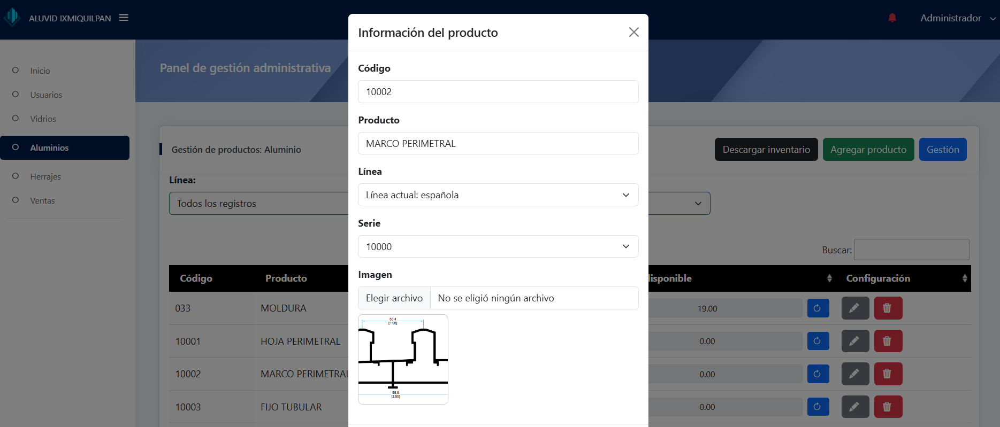

   

    <h1>🪟 ALUVID — Quotation & Management System for Glassworks</h1>
    
Built for <strong>ALUVID</strong>, a local glassworks (vidriería) in Ixmiquilpan, Hidalgo, Mexico. This system streamlines product catalog, quotations, stock management and sales reporting across three role-based panels: <em>Employee</em>, <em>Manager</em> (team manager), and <em>Administrator</em>.

      
      
      
      
    

<h2>✨ Highlights</h2>
    <ul>
      <li>Three role-based web panels: <strong>Employee</strong>, <strong>Manager</strong>, and <strong>Administrator</strong>. 🔐</li>
      <li>Employee-facing product catalog (Aluminum, Hardware, Glass) and quotation generator. 🧾</li>
      <li>Manager panel for user management, inventory control and sales management with daily/weekly/monthly reports. 📊</li>
      <li>Administrator panel for high-level inventory and sales auditing. 🛠️ </li>
      <li>DataTables integrated for fast, paginated, searchable tables. ⚡</li>
      <li>Role-based authentication and authorization. 👥</li>
      <li>Database normalized to store and manage 300+ products efficiently. 🗄️</li>
    </ul>

<h2>📣 Features by Panel</h2>

<h3>Employee Panel</h3>
    <ul>
      <li>Company info + product browsing (categories: Aluminum, Hardware, Glass)</li>
    </ul>
    

      
      
      
      
      
    

    <ul>
      <li>Quotation creation flow and cart management connected to current stock</li>
    </ul>
    

      
      
      
      
      
      
      
    

 <h3>Manager Panel</h3>
    <ul>
      <li>Team login & dashboard</li>
    </ul>
    

      
      
    

    <ul>
      <li>User management</li>
    </ul>
    

      
    

    <ul>
      <li>Inventory & stock adjustments</li>
    </ul>
    

      
      
      
    

    <ul>
      <li>Sales management + daily/weekly/monthly reports + edit past sales</li>
    </ul>
    

      
      
      
      
    

<h3>Administrator Panel</h3>
    <ul>
      <li>Admin dashboard</li>
    </ul>
    

      
    

    <ul>
      <li>Inventory queries & reports</li>
    </ul>
    

      
      
      
      
    

    <ul>
      <li>Sales auditing & export</li>
    </ul>
    

      
      
    

<footer style="margin-top:18px;color:#6b7280;font-size:13px">Generated README — English (professional) • Screenshots arranged with responsive grid layout.</footer>
  

## About Laravel

Laravel is a web application framework with expressive, elegant syntax. We believe development must be an enjoyable and creative experience to be truly fulfilling. Laravel takes the pain out of development by easing common tasks used in many web projects, such as:

- [Simple, fast routing engine](https://laravel.com/docs/routing).
- [Powerful dependency injection container](https://laravel.com/docs/container).
- Multiple back-ends for [session](https://laravel.com/docs/session) and [cache](https://laravel.com/docs/cache) storage.
- Expressive, intuitive [database ORM](https://laravel.com/docs/eloquent).
- Database agnostic [schema migrations](https://laravel.com/docs/migrations).
- [Robust background job processing](https://laravel.com/docs/queues).
- [Real-time event broadcasting](https://laravel.com/docs/broadcasting).

Laravel is accessible, powerful, and provides tools required for large, robust applications.

## Learning Laravel

Laravel has the most extensive and thorough [documentation](https://laravel.com/docs) and video tutorial library of all modern web application frameworks, making it a breeze to get started with the framework.

You may also try the [Laravel Bootcamp](https://bootcamp.laravel.com), where you will be guided through building a modern Laravel application from scratch.

If you don't feel like reading, [Laracasts](https://laracasts.com) can help. Laracasts contains thousands of video tutorials on a range of topics including Laravel, modern PHP, unit testing, and JavaScript. Boost your skills by digging into our comprehensive video library.

## Laravel Sponsors

We would like to extend our thanks to the following sponsors for funding Laravel development. If you are interested in becoming a sponsor, please visit the [Laravel Partners program](https://partners.laravel.com).

### Premium Partners

- **[Vehikl](https://vehikl.com/)**
- **[Tighten Co.](https://tighten.co)**
- **[WebReinvent](https://webreinvent.com/)**
- **[Kirschbaum Development Group](https://kirschbaumdevelopment.com)**
- **[64 Robots](https://64robots.com)**
- **[Curotec](https://www.curotec.com/services/technologies/laravel/)**
- **[Cyber-Duck](https://cyber-duck.co.uk)**
- **[DevSquad](https://devsquad.com/hire-laravel-developers)**
- **[Jump24](https://jump24.co.uk)**
- **[Redberry](https://redberry.international/laravel/)**
- **[Active Logic](https://activelogic.com)**
- **[byte5](https://byte5.de)**
- **[OP.GG](https://op.gg)**

## Contributing

Thank you for considering contributing to the Laravel framework! The contribution guide can be found in the [Laravel documentation](https://laravel.com/docs/contributions).

## Code of Conduct

In order to ensure that the Laravel community is welcoming to all, please review and abide by the [Code of Conduct](https://laravel.com/docs/contributions#code-of-conduct).

## Security Vulnerabilities

If you discover a security vulnerability within Laravel, please send an e-mail to Taylor Otwell via [taylor@laravel.com](mailto:taylor@laravel.com). All security vulnerabilities will be promptly addressed.

## License

The Laravel framework is open-sourced software licensed under the [MIT license](https://opensource.org/licenses/MIT).
